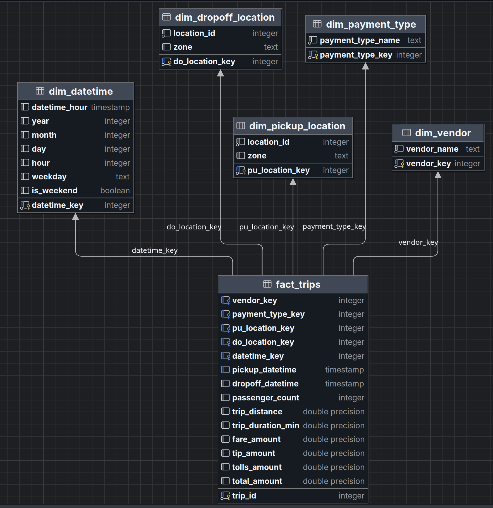

# PSet 2 — Pipeline ELT de NY Taxi

**Fundamentos de Ciencia de Datos — Universidad San Francisco de Quito stan moore 222**

Un pipeline ELT de extremo a extremo que ingesta, almacena, transforma y modela datos de viajes en taxi amarillo de la ciudad de Nueva York (2025) usando Mage AI, PostgreSQL y Docker Compose.

---

## Tabla de contenidos

1. [Objetivo](#objetivo)
2. [Arquitectura](#arquitectura)
3. [Estructura del proyecto](#estructura-del-proyecto)
4. [Requisitos previos](#requisitos-previos)
5. [Cómo levantar el entorno](#cómo-levantar-el-entorno)
6. [Cómo configurar credenciales en Mage](#cómo-configurar-credenciales-en-mage)
7. [Cómo ejecutar los pipelines](#cómo-ejecutar-los-pipelines)
8. [Cómo acceder a pgAdmin](#cómo-acceder-a-pgadmin)
9. [Cómo validar resultados en PostgreSQL](#cómo-validar-resultados-en-postgresql)
10. [Triggers y automatización](#triggers-y-automatización)
11. [Configuración y credenciales](#configuración-y-credenciales)
12. [Descripción de schemas y tablas](#descripción-de-schemas-y-tablas)
13. [Modelo dimensional](#modelo-dimensional)
14. [Decisiones de limpieza de datos](#decisiones-de-limpieza-de-datos)
15. [Decisiones de diseño](#decisiones-de-diseño)
16. [Nota de seguridad](#nota-de-seguridad)
17. [Conclusiones](#conclusiones)

---

## Objetivo

Construir una arquitectura ELT reproducible que:

- **Extrae** archivos parquet de NY Taxi desde un CDN público
- **Carga** los datos crudos en PostgreSQL sin aplicar lógica de negocio
- **Transforma** los datos crudos en un esquema estrella limpio con tablas de hechos y dimensiones
- Orquesta todo automáticamente con schedules de Mage AI

---

## Arquitectura

```
CDN público NY Taxi (parquet)
        │
        ▼
┌───────────────────────┐
│  Mage AI              │
│  Pipeline 1: raw      │  ── descarga mes a mes, chunks de 50K filas
└────────┬──────────────┘
         │
         ▼
┌────────────────────────┐
│  PostgreSQL            │
│  schema: raw           │
│  tabla:  taxi_trips_ny │
└────────┬───────────────┘
         │
         ▼
┌──────────────────────────┐
│  Mage AI                 │
│  Pipeline 2: clean       │  ── lee candidatos DISTINCT para dimensiones,
└────────┬─────────────────┘     luego limpia y carga la fact table mes a mes
         │
         ▼
┌──────────────────────────────────────┐
│  PostgreSQL                          │
│  schema: clean                       │
│  tablas: dim_vendor                  │
│          dim_payment_type            │
│          dim_pickup_location         │
│          dim_dropoff_location        │
│          dim_datetime                │
│          fact_trips                  │
└──────────────────────────────────────┘
         │
         ▼
┌──────────────┐
│  pgAdmin     │  ── inspección y validación
└──────────────┘
```

Todos los servicios corren localmente mediante Docker Compose en una red interna con volúmenes persistentes.

---

## Estructura del proyecto

```
pset2_ny_taxi/
├── docker-compose.yaml         # Define los servicios PostgreSQL, Mage y pgAdmin
├── README.md                   # Este archivo
├── mage-volume/                # Proyecto Mage (pipelines, bloques, configuración)
│   └── orquestador/
│       ├── io_config.yaml      # Perfil de conexión — usa Mage Secrets para las credenciales
│       ├── data_loaders/
│       │   ├── extract_data.py         # Pipeline 1: descarga parquet, carga a raw
│       │   └── load_from_raw.py        # Pipeline 2: carga candidatos DISTINCT para dims
│       ├── transformers/
│       │   └── transform_to_dimensional.py  # Pipeline 2: construye DataFrames de dimensiones
│       └── data_exporters/
│           ├── save_data.py            # Pipeline 1: registra resumen de ingesta
│           └── export_to_clean.py      # Pipeline 2: escribe el esquema estrella en PostgreSQL
├── data-volume/                # Datos persistentes de PostgreSQL (creado automáticamente por Docker)
├── data-ui-volume/             # Datos persistentes de pgAdmin (creado automáticamente por Docker)
└── screenshots/
    └── star_diagram.png        # Diagrama del modelo dimensional (esquema estrella)
```

---

## Requisitos previos

- Docker Desktop (o Docker Engine + plugin de Docker Compose)
- Mínimo 8 GB de RAM libre recomendados
- Conexión a internet para descargar los archivos parquet desde el CDN

---

## Cómo levantar el entorno

**1. Clonar el repositorio**

```bash
git clone <url-del-repositorio>
cd pset2_ny_taxi
```

**2. Levantar todos los servicios**

```bash
docker compose up -d
```

**3. Verificar que los servicios estén corriendo**

```bash
docker compose ps
```

Deberías ver tres contenedores activos: `data-warehouse`, `orquestador` y `warehouse-ui`.

| Servicio   | URL                    |
|------------|------------------------|
| Mage AI    | http://localhost:6789   |
| pgAdmin    | http://localhost:9000   |
| PostgreSQL | localhost:5432          |

---

## Credenciales en Mage

Las credenciales de PostgreSQL están preconfiguradas en el repositorio mediante **Mage Secrets**. No es necesario configurar nada — al levantar el entorno con `docker compose up`, Mage carga automáticamente los secrets desde el volumen incluido en el proyecto.

Los secrets ya registrados son:

| Nombre del secret | Valor            |
|-------------------|------------------|
| `pg_db`           | `warehouse`      |
| `pg_host`         | `data-warehouse` |
| `pg_user`         | `root`           |
| `pg_password`     | `root`           |

> El archivo `io_config.yaml` referencia estos valores con `{{ mage_secret_var('nombre') }}` en lugar de texto plano. Los pipelines los leen automáticamente en cada ejecución.

---

## Cómo ejecutar los pipelines

### Pipeline 1 — `raw_ingestion_pipeline`

Este pipeline descarga todos los archivos parquet de NY Taxi 2025 desde el CDN público y los carga en `raw.taxi_trips_ny`.

1. Abrir Mage en http://localhost:6789
2. Hacer clic en **Pipelines** en la barra lateral izquierda
3. Hacer clic en `raw ingestion pipeline`
4. Hacer clic en **Run pipeline** (botón de play, arriba a la derecha)
5. Monitorear el progreso en los logs — cada mes imprime el estado de descarga y el conteo de filas

Salida esperada:

```
── Month 01/2025 → downloading...
   2,964,624 rows / 60 chunks
   chunk 1/60 rows 0–50,000 (replace) ✓
   ...
✅ Done — XX,XXX,XXX total rows inserted into raw.taxi_trips_ny
```

### Pipeline 2 — `clean_transformation_pipeline`

Este pipeline lee desde `raw.taxi_trips_ny`, aplica reglas de limpieza y carga un esquema estrella completo en el schema `clean`.

**Ejecutar este pipeline únicamente después de que el Pipeline 1 haya terminado.**

1. Volver a **Pipelines**
2. Hacer clic en `clean_transformation_pipeline`
3. Hacer clic en **Run pipeline**
4. Monitorear los logs — primero se cargan las dimensiones, luego las filas de hechos mes a mes

Salida esperada:

```
datetime lookup built: X,XXX entries

── Creating schema and tables...
── Inserting unknown (-1) sentinel rows...
── Loading dimension tables...
  ✓ clean.dim_vendor: 3 rows
  ✓ clean.dim_payment_type: 6 rows
  ✓ clean.dim_pickup_location: 265 rows
  ✓ clean.dim_dropoff_location: 265 rows
  ✓ clean.dim_datetime: X,XXX rows

── Loading fact_trips month by month...
  2025-01: X,XXX,XXX raw → X,XXX,XXX clean  (XX,XXX removed)
  ...
✅ Star schema complete — XX,XXX,XXX fact rows
```

---

## Cómo acceder a pgAdmin

1. Abrir http://localhost:9000
2. Iniciar sesión con:
   - **Email**: `gadi.moore223@gmail.com`
   - **Password**: `root`
3. Agregar un nuevo servidor:
   - **Name**: warehouse
   - **Host**: `data-warehouse` ← usar el nombre del servicio de Docker, no `localhost`
   - **Port**: `5432`
   - **Database**: `warehouse`
   - **Username**: `root`
   - **Password**: `root`
4. Navegar a **Servers → warehouse → Databases → warehouse → Schemas**

Verás dos schemas: `raw` y `clean`.

---

## Cómo validar resultados en PostgreSQL

Abrir el query tool de pgAdmin y ejecutar estas consultas:

**Contar filas crudas:**
```sql
SELECT COUNT(*) FROM raw.taxi_trips_ny;
```

**Contar filas por tabla:**
```sql
SELECT 'dim_vendor'           AS tabla, COUNT(*) FROM clean.dim_vendor
UNION ALL
SELECT 'dim_payment_type',            COUNT(*) FROM clean.dim_payment_type
UNION ALL
SELECT 'dim_pickup_location',         COUNT(*) FROM clean.dim_pickup_location
UNION ALL
SELECT 'dim_dropoff_location',        COUNT(*) FROM clean.dim_dropoff_location
UNION ALL
SELECT 'dim_datetime',                COUNT(*) FROM clean.dim_datetime
UNION ALL
SELECT 'fact_trips',                  COUNT(*) FROM clean.fact_trips;
```

**Consulta de ejemplo con joins (hechos + dimensiones):**
```sql
SELECT
    f.trip_id,
    v.vendor_name,
    p.payment_type_name,
    d.year,
    d.month,
    d.weekday,
    f.trip_distance,
    f.fare_amount,
    f.tip_amount,
    f.total_amount
FROM clean.fact_trips       f
JOIN clean.dim_vendor       v ON f.vendor_key       = v.vendor_key
JOIN clean.dim_payment_type p ON f.payment_type_key = p.payment_type_key
JOIN clean.dim_datetime     d ON f.datetime_key     = d.datetime_key
LIMIT 20;
```

**Tarifa y propina promedio por tipo de pago:**
```sql
SELECT
    p.payment_type_name,
    COUNT(*)                    AS viajes,
    ROUND(AVG(f.fare_amount)::numeric, 2)   AS tarifa_promedio,
    ROUND(AVG(f.tip_amount)::numeric, 2)    AS propina_promedio
FROM clean.fact_trips       f
JOIN clean.dim_payment_type p ON f.payment_type_key = p.payment_type_key
WHERE f.payment_type_key != -1
GROUP BY p.payment_type_name
ORDER BY viajes DESC;
```

---

## Triggers y automatización

Ambos pipelines tienen triggers de schedule configurados en Mage.

| Pipeline                         | Nombre del trigger       | Expresión cron | Horario                          |
|----------------------------------|--------------------------|----------------|----------------------------------|
| `raw_ingestion_pipeline`         | `raw_monthly_schedule`   | `0 2 1 * *`    | El día 1 de cada mes a las 02:00 |
| `clean_transformation_pipeline`  | `clean_monthly_schedule` | `0 5 1 * *`    | El día 1 de cada mes a las 05:00 |

**Lógica de dependencia:** El pipeline raw se ejecuta a las 02:00 y el pipeline clean a las 05:00 del mismo día. El intervalo de 3 horas garantiza que la ingesta de datos crudos esté completa antes de que la transformación lea desde `raw.taxi_trips_ny`. Mage no soporta encadenamiento nativo de pipelines en la versión gratuita, por lo que el desfase de horario es la solución estándar.

Ambos triggers tienen habilitada la opción **Skip run if previous run still in progress** para evitar ejecuciones superpuestas.

Para activar los triggers:
1. Ir a **Pipelines → raw ingestion pipeline → Triggers**
2. Hacer clic en el toggle **Enable** en `raw_monthly_schedule`
3. Repetir para `clean_transformation_pipeline`

---

## Configuración y credenciales

**docker-compose.yaml:**
```yaml
services:
  data-warehouse:
    image: postgres:13
    environment:
      POSTGRES_USER: root
      POSTGRES_PASSWORD: root
      POSTGRES_DB: warehouse
    volumes:
      - ./data-volume:/var/lib/postgresql/data
    ports:
      - "5432:5432"
    healthcheck:
      test: ["CMD-SHELL","pg_isready -U root -d warehouse"]
      interval: 5s
      timeout: 5s
      retries: 10
      start_period: 10s

  warehouse-ui:
    image: dpage/pgadmin4
    environment:
      - PGADMIN_DEFAULT_EMAIL=gadi.moore223@gmail.com
      - PGADMIN_DEFAULT_PASSWORD=root
    ports:
      - "9000:80"

  orquestador:
    image: mageai/mageai
    volumes:
      - ./mage-volume:/home/src
    ports:
      - "6789:6789"
    command: /app/run_app.sh mage start orquestador
```

**io_config.yaml (sección PostgreSQL):**
```yaml
POSTGRES_CONNECT_TIMEOUT: 10
POSTGRES_DBNAME: "{{ mage_secret_var('pg_db') }}"
POSTGRES_USER: "{{ mage_secret_var('pg_user') }}"
POSTGRES_PASSWORD: "{{ mage_secret_var('pg_password') }}"
POSTGRES_HOST: "{{ mage_secret_var('pg_host') }}"
POSTGRES_PORT: 5432
```

Las credenciales se inyectan en tiempo de ejecución a través de Mage Secrets (ver sección [Cómo configurar credenciales en Mage](#cómo-configurar-credenciales-en-mage)).

---

## Descripción de schemas y tablas

### Schema `raw`

| Tabla            | Descripción                                                                           |
|------------------|---------------------------------------------------------------------------------------|
| `taxi_trips_ny`  | Registros crudos de viajes en taxi amarillo de NY para 2025, cargados directamente desde archivos parquet. Solo se aplicó normalización de nombres de columnas a minúsculas. Sin lógica de negocio. |

**Columnas preservadas desde la fuente:** `vendorid`, `tpep_pickup_datetime`, `tpep_dropoff_datetime`, `passenger_count`, `trip_distance`, `ratecodeid`, `store_and_fwd_flag`, `pulocationid`, `dolocationid`, `payment_type`, `fare_amount`, `extra`, `mta_tax`, `tip_amount`, `tolls_amount`, `improvement_surcharge`, `total_amount`, `congestion_surcharge`, `airport_fee`.

### Schema `clean`

| Tabla                    | Descripción                                                           |
|--------------------------|-----------------------------------------------------------------------|
| `dim_vendor`             | Catálogo de proveedores de taxi (Creative Mobile Technologies, VeriFone Inc) |
| `dim_payment_type`       | Catálogo de métodos de pago (Tarjeta de crédito, Efectivo, Sin cargo, etc.) |
| `dim_pickup_location`    | Catálogo de zonas de recogida (IDs de zona TLC)                       |
| `dim_dropoff_location`   | Catálogo de zonas de destino (IDs de zona TLC)                        |
| `dim_datetime`           | Dimensión de fecha/hora con granularidad horaria                       |
| `fact_trips`             | Una fila por viaje de taxi limpio, con claves foráneas a todas las dimensiones y todas las métricas del viaje |

Todas las tablas de dimensiones incluyen una fila centinela con valor `-1` etiquetada como `'Unknown'` para manejar filas de hechos cuya clave foránea no pudo ser resuelta.

---

## Modelo dimensional



### Granularidad

Una fila por viaje de taxi en `fact_trips`, identificada de forma única mediante `trip_id` (clave sustituta secuencial).

### Métricas de la tabla de hechos

| Columna              | Tipo             | Descripción                              |
|----------------------|------------------|------------------------------------------|
| `trip_distance`      | DOUBLE PRECISION | Millas recorridas                        |
| `trip_duration_min`  | DOUBLE PRECISION | Duración en minutos (métrica derivada)   |
| `passenger_count`    | INTEGER          | Número de pasajeros                      |
| `fare_amount`        | DOUBLE PRECISION | Tarifa base medida por el taxímetro      |
| `tip_amount`         | DOUBLE PRECISION | Propina pagada                           |
| `tolls_amount`       | DOUBLE PRECISION | Peajes pagados                           |
| `total_amount`       | DOUBLE PRECISION | Total cobrado al pasajero                |

### Claves foráneas

| Columna FK            | Referencia                                   |
|-----------------------|----------------------------------------------|
| `vendor_key`          | `dim_vendor.vendor_key`                      |
| `payment_type_key`    | `dim_payment_type.payment_type_key`          |
| `pu_location_key`     | `dim_pickup_location.pu_location_key`        |
| `do_location_key`     | `dim_dropoff_location.do_location_key`       |
| `datetime_key`        | `dim_datetime.datetime_key`                  |

---

## Decisiones de limpieza de datos

| Regla | Justificación |
|-------|---------------|
| Eliminar filas con `pickup_datetime`, `dropoff_datetime`, `pu_location_id` o `do_location_id` nulos | Son claves foráneas no nulas — las filas sin ellas no pueden ubicarse en el modelo |
| Filtrar `pickup_datetime >= 2015-01-01` y `dropoff_datetime <= 2025-12-31` | Elimina registros con timestamps claramente erróneos |
| Filtrar `pickup_datetime <= dropoff_datetime` | Un viaje no puede terminar antes de comenzar |
| Filtrar `trip_duration_min > 0` y `< 600` | Duración cero o negativa es imposible; más de 10 horas es casi seguramente un error |
| Filtrar `trip_distance >= 0` y `< 500` | Distancia negativa es imposible; 500 millas excede cualquier viaje realista en NYC |
| Filtrar `fare_amount`, `total_amount`, `tip_amount >= 0` | Montos monetarios negativos no son válidos |
| Imputar `passenger_count` nulo o 0 → 1 | El viaje igualmente ocurrió; 1 es la suposición conservadora |
| Eliminar duplicados exactos | Evita el doble conteo en agregaciones |

Las columnas no presentes en un archivo mensual (por ejemplo `tolls_amount`) se rellenan con `0.0` en lugar de lanzar un error, lo que hace al pipeline resistente a variaciones de schema entre meses.

---

## Decisiones de diseño

**¿Por qué dos pipelines separados?**
Correcta separación de responsabilidades: raw es inmutable y no debe contener lógica de negocio; clean es la capa analítica derivada. Mantenerlos separados permite reejecutar solo la transformación sin volver a descargar los datos fuente.

**¿Por qué cargar candidatos de dimensiones con queries DISTINCT?**
Cargar toda la tabla raw en pandas para extraer valores de dimensiones causaría problemas de memoria con millones de filas. Las queries DISTINCT devuelven solo los valores únicos necesarios, que son a lo sumo unos pocos miles de filas.

**¿Por qué procesar la fact table mes a mes?**
Cada archivo mensual tiene entre 2 y 4 millones de filas. Cargar todo el año en memoria de una vez requeriría más de 10 GB de RAM. El procesamiento mensual mantiene el uso de memoria predecible y permite ver el progreso en tiempo real.

**¿Por qué usar `auto_clean_name=False` en los exports?**
Mage AI renombra silenciosamente columnas que coinciden con palabras reservadas de PostgreSQL (`zone`, `year`, `month`, `day`, `hour`) añadiéndoles un guion bajo al frente, causando un mismatch entre el DDL creado manualmente y el INSERT generado. Desactivarlo mantiene los nombres de columna exactamente como están definidos.

**¿Por qué Mage Secrets en lugar de texto plano en `io_config.yaml`?**
Mage Secrets evita que las credenciales queden registradas en el historial de git. Los valores se almacenan cifrados dentro del contenedor de Mage y se inyectan en tiempo de ejecución. El paso de configuración inicial es único y tarda menos de un minuto (ver sección [Cómo configurar credenciales en Mage](#cómo-configurar-credenciales-en-mage)).

---

## Nota de seguridad

Este proyecto fue diseñado para un entorno académico donde la reproducibilidad es la prioridad: cualquier evaluador puede clonar el repositorio, levantar Docker y registrar cuatro secrets en Mage para tener el pipeline funcionando sin configuración adicional.

Las credenciales utilizadas (`root`/`root`) son apropiadas para un entorno local de desarrollo. **En un proyecto productivo o con datos de clientes reales se deberían aplicar las siguientes medidas:**

- Contraseñas fuertes y únicas por entorno (desarrollo, staging, producción)
- Credenciales inyectadas mediante variables de entorno en tiempo de despliegue, nunca almacenadas en el repositorio
- Acceso a PostgreSQL restringido por red — sin exposición del puerto `5432` al exterior
- Uso de roles de base de datos con privilegios mínimos (solo lectura/escritura en los schemas necesarios, sin permisos de superusuario)
- Rotación periódica de contraseñas y auditoría de accesos
- pgAdmin no expuesto en producción — reemplazar por herramientas de observabilidad internas

---

## Conclusiones

Este proyecto demostró la construcción de un pipeline ELT completo sobre datos reales a escala de producción. Las principales lecciones aprendidas son:

**Sobre la arquitectura ELT:**
La separación entre capa raw y capa clean resultó fundamental. Mantener los datos crudos intactos permitió reejecutar la transformación múltiples veces durante el desarrollo sin necesidad de volver a descargar los archivos parquet desde el CDN, ahorrando tiempo y ancho de banda considerables.

**Sobre el modelado dimensional:**
El esquema estrella simplifica enormemente las consultas analíticas. Un JOIN entre `fact_trips` y las tablas de dimensión permite responder preguntas de negocio complejas (comportamiento por zona, hora, tipo de pago) con SQL directo y sin subconsultas anidadas. Las filas centinela con clave `-1` son un patrón indispensable para mantener la integridad referencial sin descartar hechos válidos que tienen dimensiones desconocidas.

**Sobre la calidad de datos:**
Los datos de NY Taxi contienen ruido significativo: timestamps imposibles, distancias negativas, duraciones de cero segundos y duplicados exactos. Las reglas de limpieza implementadas eliminaron entre el 1 % y el 3 % de las filas por mes, lo que confirma que la validación de datos no es opcional en pipelines reales — incluso con fuentes de datos institucionales y bien documentadas.

**Sobre la ingeniería de memoria:**
Procesar archivos de varios millones de filas requiere diseño consciente del uso de memoria. La combinación de chunks de 50K filas para la escritura y queries DISTINCT para las dimensiones permitió ejecutar el pipeline completo en una máquina local estándar sin agotar la RAM.

**Sobre la orquestación:**
Mage AI ofrece una interfaz visual que facilita el monitoreo y la depuración de cada bloque de forma independiente. El encadenamiento de pipelines mediante offsets de horario (cron) es una solución pragmática cuando no se dispone de dependencias nativas entre pipelines, aunque en producción sería preferible un orquestador con soporte explícito de DAGs como Apache Airflow o Prefect.
